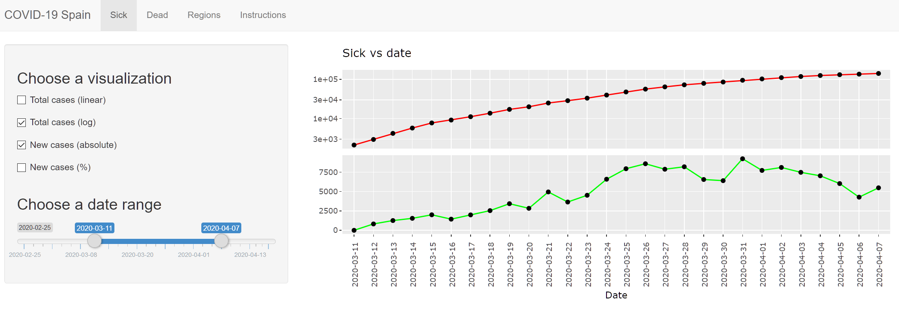

COVID-19 Spain
================

## Description
COVID-19 Spain is a visualization tool that allows the interactive study of the Spanish situation caused by the SARS-CoV-2 (COVID-19) virus.

The user can visualize the national sick and dead count and the regional sick count. Each of this options can be explored through an adjustable date range and four different visualizations:
* Total cases (linear scale)
* Total cases (logarithmic scale)
* Daily cases (absolute)
* Daily cases (+%)

## Link to the tool
The tool can be accessed [here](https://nachomcapella.shinyapps.io/covid-19/). It works in the browser, so it can be used on computers, tablets and smartphones.

## Data
The data used by the tool are the number of sick and dead caused by covid-19, both at a national and regional (CC. AA.) level.

I am specially thankful to the Datadista team who have facilitated a clean version of the data in their [GitHub repository](https://github.com/datadista/datasets/tree/master/COVID%2019). They provide a more detailed list of the sources [here](https://github.com/datadista/datasets/blob/master/COVID%2019/readme.md), being the main ones:
* [Ministerio de Sanidad, Consumo y Bienestar Social]( https://www.mscbs.gob.es/profesionales/saludPublica/ccayes/alertasActual/nCov-China/situacionActual.htm) and press office of the Ministerio de Sanidad.
* [Departamento de Seguridad Nacional](https://www.dsn.gob.es/gl/current-affairs/press-room)
* [Instituto de Salud Carlos III. Situación de COVID-19 en España](https://covid19.isciii.es/)
* [BOE: Crisis Sanitaria COVID-19](https://www.boe.es/biblioteca_juridica/codigos/codigo.php?id=355&modo=2&nota=0&tab=2)
* [Ministerio de Transportes, Movilidad y Agenda Urbana](https://www.mitma.gob.es/transporte-terrestre/punto-de-informacion-de-servicios-de-restauracion)

## Instructions
### How to use the tool
The tool has been designed to be intuitive to use. The user does not have to introduce any kind of data and actions required to adjust the plots are simple.

When the tool is started, the user encounters a screen like this:

On the top of the screen we can see four tabs (Sick, Dead, Regions and Instructions). On the left part of the screen we can see the control panel and, on the left, the plot panel. The image corresponds to the Sick tab, which is the one opened by default.
#### Sick tab
Let's start explaining the Sick tab. The Sick, Dead and Regions tabs work pretty much the same, so the explanation of this first tab should illustrate how the other two are used.

The Sick tab displays plots concerning the number of people infected with COVID-19 at a national level. We can see that we have two main areas: the control panel and the plot panel. The control panel allows the user to select between the different visualizations available and adjust the date range of the data displayed. The user can choose between four different visualizations:
* Total cases (linear): Plots the total number of sick people (y axis) against the date (x axis) using a linear scale for the y axis. That is, all the points of the y axis are spaced equally. With this plot we can see the accumulated number of sick people. For example, if the first day there are 10 sick people and on the second day there are 10 new more cases, the numbers on the plot will be 10 and 20, respectively.
* Total cases (logarithmic scale): It is similar to the previous plot. It displays the total number of sick people (y axis) against the date (x axis) using a log10 scale for the y axis. In this case, the points in the y axis are not equally distributed. The distance between 10 and 100 is the same as the distance between 100 and 1000.
* New cases (absolute): Plots the number of people that get infected each day. The number of sick people is displayed in the y axis (using a linear scale) and the date, in the x axis. Using the previous example, if the first day there are 10 sick people and on the second day there are 10 new more cases, the numbers on the plot will be 10 and 10, respectively.
* New cases (+%): It is similar to the previous plot. It displays the percertange of new infections with respect to the previous day against the date. The percertange is plotted in the y axis and the date, again, in the x axis. The percertange represented is the percertange difference between one date and the previous one. Using the same example as before, if the first day there are 10 sick people and on the second day there are 10 new more cases, the plot will display +0%, since there has been no variation. If the first day we have 10 cases and the second day we have 100, the plot will show +900%, since there are the same number of cases plus nine times more. On the other hand, if the first day we have 100 cases and the second one we have 50, the plot will display -50%.

Which visualization is shown is controlled by clicking on the control panel checkboxes. The four visualizations can be displayed simultaneously. The date range is adjusted by moving the slider ends to the desired dates. In the next image we can see an example where the user has chosen two visualizations (total cases (log) and new cases (absolute)) and a date range between the 2020-03-11 and the 2020-04-7, both included.

### Project files
